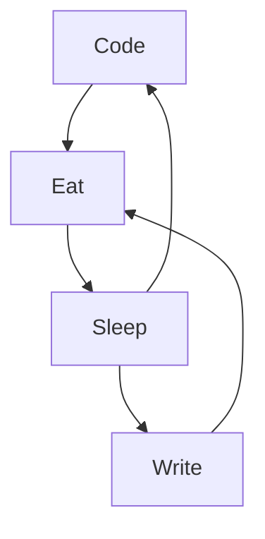

- 👋 Bonjour, je suis @wendybaque, développeuse web et web mobile ! Et no code friendly ! 🌈
- 📚 Je suis intéressée par le code (évidemment !), le yoga, la lecture, l'écriture et la nature !
- 🚀 Vous pouvez voir mes projets et mon profil sur mon [portfolio](https://wendybaqueportfoliodev.wendev.fr/)...
- ✨ ... et en savoir plus sur mon parcours professionnel sur mon profil [LinkedIn](https://www.linkedin.com/in/wendy-baqu%C3%A9/)
- 🔎 Vous souhaitez un aperçu de mes projets en ligne ? Rendez-vous sur mon [Linktree](https://linktr.ee/wendybaque) ! ENJOY ! 🤩
-----------------

# Quelques statistiques

# Hard Skills 

## Code 

## No-code
Glideapp | Softr | Zapier | Jotform | Notion | Airtable | Carrd.io

# Soft Skills 
Autonomie | Réactivité | Adaptabilité | Motiviation | Persévérance | Agilité | Capacité à prendre du recul | Capacité à gérer ses émotions | Curiosité | Empathie

# Design & Style

# En ce moment, j'apprends...

# A propos de moi

Après un bilan de compétences réalisé en full remote, je suis en reconversion professionnelle dans le domaine du développement web et web mobile. 💻 

A la suite de ma formation à la Wild Code School et un stage très enrichissant chez Fedmind et de bénévolat chez O Media, j'envisage de passer mon titre RNCP en février 2023, dans le but de créer ma propre entreprise qui vous proposera des solutions numériques personnalisées, modernes et adaptées à vos besoins.

✨ Je suis une personne rigoureuse, ce qui me permet de mener à bien mes projets et activités confiées de A à Z et de bien gérer mon temps de travail. Je fais également preuve de créativité et d'imaginativité, ce qui me pousse à trouver des solutions innovantes et originales pour répondre aux besoins des clients. 

✨Soucieuse d’améliorer ma pratique dans un monde en constante évolution, je sais faire preuve d’adaptabilité, comme le prouve ma reconversion professionnelle dans un domaine totalement nouveau pour moi. 

✨ Etre autonome dans ma pratique est important pour moi afin d'envisager tous les possibles qui s'offrent à moi et repose avant tout sur un climat de confiance établi avec le client. Lui être utile apparaît aussi primordial pour donner un sens à mon travail. 

✨ Enfin, ma curiosité me donne un goût certain pour l'apprentissage et l'actualisation de mes acquis dans un monde en constante évolution. 

🎯 Ainsi, mon objectif est de m'épanouir dans un métier porteur d'avenir et de sens, me permettant de mettre à profit mes points forts au service de mes clients, de mes collaborateurs et de votre entreprise.

🚀 Les valeurs les plus importantes dans le monde du travail sont, selon moi, l’entraide, l’écoute, l’expression de soi, l’épanouissement et la réussite. 

➕ Mon petit plus ? 
Je suis développeuse, mais aussi psychologue ! 
Ainsi, tout naturellement, je suis attirée par l' UX et l' UI. 
C'est un domaine qui me parle, et qui me tient toujours à cœur. 
Mon regard est un bonus : 100% user first et centrage sur l'accessibilité !

➕ Mon autre petit plus ? Je suis no code friendly ! Face à la demande croissante sur des outils de solutions en ligne clés en mains, je peux vous aider à augmenter votre productivité et votre efficacité grâce à des outils comme Airtable, Glideapps, ou encore Zapier. Je vous propose également des création de votre landing page sur Carrd.io, Softr ou Glidepages.

🗺️ Habituée au télétravail et résidant vers Tours (37), cela reste l'une de mes priorités. 

### My daily routine :

<!---
wendybaque/wendybaque is a ✨ special ✨ repository because its `README.md` (this file) appears on your GitHub profile.
You can click the Preview link to take a look at your changes.
--->
